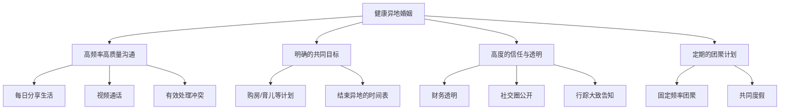

# 异地夫妻能维持多久？

## 目录

点击展开目录

- [异地夫妻能维持多久？](#异地夫妻能维持多久)
  - [目录](#目录)
  - [一、案例背景：一个典型的“三无”婚姻困境](#一案例背景一个典型的三无婚姻困境)
    - [核心问题梳理](#核心问题梳理)
  - [二、婚姻的三大支柱分析](#二婚姻的三大支柱分析)
    - [2.1 情感与沟通支柱](#21-情感与沟通支柱)
    - [2.2 经济与财务支柱](#22-经济与财务支柱)
    - [2.3 生育与家庭发展支柱](#23-生育与家庭发展支柱)
  - [三、网友观点分类与决策模型](#三网友观点分类与决策模型)
    - [3.1 “劝离派”：止损与风险规避](#31-劝离派止损与风险规避)
    - [3.2 “劝和派”：底线思维与现状维持](#32-劝和派底线思维与现状维持)
    - [3.3 “沟通尝试派”：最后的努力](#33-沟通尝试派最后的努力)
  - [四、异地婚姻的维持要素与风险地图](#四异地婚姻的维持要素与风险地图)
    - [4.1 健康异地婚姻的要素](#41-健康异地婚姻的要素)
    - [4.2 高风险信号（Red Flags）](#42-高风险信号red-flags)
  - [五、决策框架与行动建议](#五决策框架与行动建议)
    - [5.1 自我评估清单](#51-自我评估清单)
    - [5.2 分步行动指南](#52-分步行动指南)
  - [六、总结与反思](#六总结与反思)

## 一、案例背景：一个典型的“三无”婚姻困境
本案例源于一位女性网友（发帖人“卫颜婧安”）在婚姻吧的求助。她描述了一段持续三年的婚姻，呈现出 **“无深度沟通、无财务透明、无共同子女”** 的典型困境。

### 核心问题梳理
| 问题维度 | 具体表现 | 潜在风险 |
| :--- | :--- | :--- |
| **情感沟通** | 1. **单向告知**：丈夫遇事只与原生家庭商量，告知妻子结果。 2. **话题回避**：回避正经事，日常交流仅限于“吃饭睡觉”等表面话题。 3. **信息屏蔽**：不告知具体工作内容、地点及变动。 | 夫妻情感联结断裂，妻子被排除在核心决策圈外，缺乏家庭归属感。 |
| **财务关系** | 1. **收入不透明**：丈夫工资数额未知。 2. **定额供给**：每月仅提供2000元生活费，性质不明（是家庭开支还是个人零用？）。 3. **财产隔离**：双方财务完全独立且不对等。 | **经济控制**风险；未来如遇丈夫债务、赌博或转移资产，妻子将毫无防备。 |
| **生育问题** | 1. **三年无子**：结婚三年，聚少离多，未有孩子。 2. **原因成谜**：从网友回复推测，可能涉及男方 **“死精”**（不育）等身体原因。 3. **家庭压力**：婆家曾提议抱养丈夫姐姐的孩子，遭妻子拒绝。 | 触及婚姻核心功能与个人生育权；无子女纽带使婚姻关系更脆弱。 |
| **关系模式** | 1. **婚前婚后反差**：婚前婆家承诺“当女儿待”，婚后“集体变脸”。 2. **异地状态**：聚少离多，缺乏共同生活基础。 3. **相亲结合**：感情基础薄弱，更多是家庭认可下的结合。 | 婚姻缺乏情感基石，易在压力下崩塌。 |

## 二、婚姻的三大支柱分析
一段稳定的婚姻通常依赖于三大支柱：**情感沟通、经济共享、共同发展（如生育）**。本案例中，这三根支柱均出现严重问题。

### 2.1 情感与沟通支柱
- **现状**：沟通渠道基本关闭。丈夫的沉默和话题转移是一种 **“情感冷暴力”** ，其目的是避免冲突，但实质是拒绝让妻子参与其生活和决策。
- **影响**：没有情感流动的婚姻，实质是 **“合租室友”** 关系，且是关系最差的那种。异地放大了沟通障碍，使得小问题无法及时解决，积压成信任危机。
- **关键点**：网友“心灬门”对比了自己的异地婚姻：“我和我老婆也是异地，一个月见一次，但**每天都视频，感情还好**”。这揭示了**异地不是问题，缺乏沟通意愿和机制才是核心问题**。

### 2.2 经济与财务支柱
- **现状**：一种 **“供养者”模式**，而非 **“合伙人”模式**。每月2000元更像是一种象征性的家庭责任履行，而非基于信任和共同目标的财务安排。
- **风险分析**：
  1.  **控制与依附**：经济不透明是控制的一种形式，使妻子在经济上处于依附地位。
  2.  **隐藏风险**：如网友“k55867”指出，隐瞒财产可能掩盖 **“找小三、PC、赌博、借网贷”** 等重大风险，妻子在风险爆发时将非常被动。
  3.  **未来保障缺失**：婚姻中的经济贡献不被看见和认可，一旦婚姻破裂，妻子在财产分割上极为不利。

### 2.3 生育与家庭发展支柱
- **现状**：生育问题可能是所有矛盾的焦点。男方可能存在的生育障碍，加上沟通不畅，导致问题被回避和掩盖。
- **社会与家庭压力**：在传统观念中，生育是婚姻的重要任务。婆家提议抱养姐姐孩子，说明家庭内部已就“男方不育”达成共识，但解决方案完全无视妻子作为母亲的血缘情感需求。
- **个人选择权**：如网友“卢伟889”所说：“你自己能生，干嘛保养别人的”。话虽直白，但点出了核心：**妻子是否有权基于自身意愿，选择成为生物学母亲？** 这是她的基本权利。

## 三、网友观点分类与决策模型
针对“是否有必要维持”，网友回复可归纳为三大类，代表了不同的价值观和决策逻辑。

### 3.1 “劝离派”：止损与风险规避
这是主流声音。核心逻辑是 **“及时止损”** ，尤其在 **“没有孩子”** 这一关键前提下。
- **理由1：三无状态**：网友“空华”总结：“**没感情，没财产，没孩子。图什么呢**”。
- **理由2：重大缺陷**：认为男方生育问题且全家态度奇葩是不可调和的矛盾。“颠沛而流离”指出：“**男人不行更要不得**”。
- **理由3：未来风险**：基于现状推断未来风险极高，离开是理性选择。
- **行动建议**：“趁没有孩子，早些吧”（阿喏king）、“赶紧跑路吧”（懒猫咕咕）。

### 3.2 “劝和派”：底线思维与现状维持
少数观点，秉持极低的婚姻期待。
- **核心逻辑**：只要不触犯“赌博、负债、出轨”等底线，婚姻就可以作为一种低质量但稳定的生存形式维持下去。代表观点：“不赌博，不负债。不出轨，那就继续呗。”（小布丁军）
- **潜在问题**：这种观点忽视了情感需求和个人成长，将婚姻工具化，可能长期压抑个人幸福感。

### 3.3 “沟通尝试派”：最后的努力
部分网友建议进行最后一次严肃沟通。
- **建议**：“强硬点和他沟通”（Fraysun）、“敞开心扉谈一谈”（问渠那得清如水）。
- **价值**：无论结果如何，进行一次彻底沟通既是给婚姻的机会，也是为自己“尽力了”寻求一个心安理得的结局，减少未来后悔的可能。
- **沟通目标**：必须明确议题：财务透明、生育计划、夫妻沟通模式、未来共同生活规划。

## 四、异地婚姻的维持要素与风险地图
并非所有异地婚姻都会失败。成功的异地婚姻需要更强的维系要素来抵消距离带来的负面影响。

### 4.1 健康异地婚姻的要素

### 4.2 高风险信号（Red Flags）
本案例几乎触发了所有高风险信号：
1.  **信息黑洞**：配偶的工作、收入、社交成为谜团。
2.  **财务隔离**：完全独立且不透明的经济安排。
3.  **回避重大议题**：如生育、未来规划等。
4.  **原生家庭过度介入**：夫妻系统被原生家庭系统取代。
5.  **缺乏结束异地的计划**：异地状态无限期持续。

## 五、决策框架与行动建议
对于处于类似困境中的人，可遵循以下框架进行思考和行动。

### 5.1 自我评估清单
在决定“离”或“合”之前，先诚实地回答以下问题：
- **情感上**：我还爱他/对他有感情吗？这段婚姻带给我的孤独多，还是温暖多？
- **沟通上**：我们是否还有就核心问题进行有效沟通的可能？他是否愿意改变？
- **经济上**：我是否能接受一辈子不清楚伴侣的经济状况？我的经济是否独立？
- **生育上**：没有孩子，我是否能接受？如果不能，他是否愿意并能够配合解决（治疗、辅助生殖等）？
- **未来展望**：我们能描绘出一个双方都认可的、具体的未来共同生活图景吗？

### 5.2 分步行动指南
1.  **信息收集**：尝试平和地了解丈夫当前工作的城市、行业、大致收入范围。这不是查岗，而是作为配偶应有的知情权。
2.  **发起终极对话**：
    - **环境**：选择面对面、无干扰的环境。
    - **方式**：使用“我陈述句”（如“我感到被排除在外…”），而非指责句（“你总是…”）。
    - **议题**：明确列出沟通议题清单：财务透明方案、生育问题诊断与计划、日常沟通模式、未来1-2年结束异地的可能性。
    - **底线**：明确告知你的底线和需求（如“我需要知道家庭总收入”、“我们必须一起面对生育问题”）。
3.  **评估反应**：
    - **积极回应**：愿意开放信息、共同寻求解决方案（如一起看医生、规划团聚）。可给予婚姻观察期。
    - **消极回避/拒绝**：继续沉默、敷衍、拒绝改变。这表明他无意修复关系。
4.  **寻求外部支持**：
    - **与自家父母沟通**：告知他们真实情况，争取理解和支持，而非一味劝和。
    - **法律咨询**：了解离婚程序、财产分割原则（尽管目前你掌握的财产信息很少），做到心中有数。
5.  **做出决策**：
    - 如果评估后认为无改善可能，**“趁没有孩子，早些吧”** 是最理性的选择。没有孩子的羁绊，离婚程序相对简单，个人重启生活的成本也较低。
    - 继续维持一段“三无”婚姻，消耗的是自己最宝贵的青春和情感能量。

## 六、总结与反思
1.  **婚姻的本质**：婚姻应是 **“战友+爱人”** 的关系，共同面对生活，共享信息与资源，共担风险与责任。本案例中的婚姻已异化为一种 **“形式化的、信息不对称的远程供养关系”**。
2.  **异地的考验**：异地像一面放大镜，会放大婚姻中已有的问题。感情好的夫妻，异地是暂时的考验；感情基础差、沟通不畅的夫妻，异地则是致命的加速器。
3.  **决策的核心**：关键在于 **“这段关系是否还能满足你核心的情感、安全与发展需求”** 。当一段关系带来的消耗远大于滋养时，离开不是失败，而是对自己生命的负责。
4.  **教训与启示**：对于通过相亲步入婚姻的人，**婚前深入了解、建立有效沟通模式、对重大议题（财务、生育、职业规划）达成共识**，比“家人满意”更重要。婚姻是自己的，不是演给家人看的戏。

最终，如网友“问渠那得清如水”所言，类似案例揭示了部分婚姻的现实：“**真的有的女孩子只是相亲，家人都满意就把自己嫁了，没什么感情基础**”。打破这种模式，需要个人在婚姻中有更强的自主意识和维护自身权益的能力。

> 原文链接：[https://tieba.baidu.com/p/10544135366](https://tieba.baidu.com/p/10544135366)